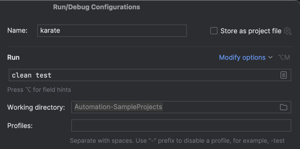
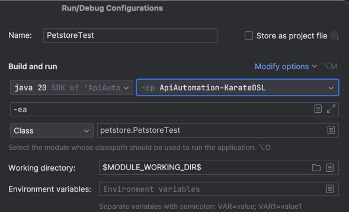
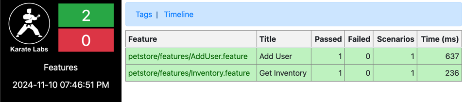
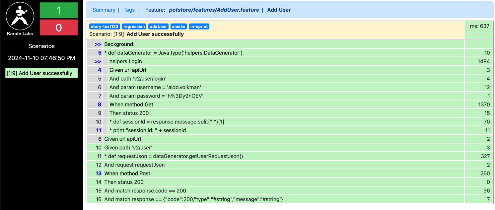
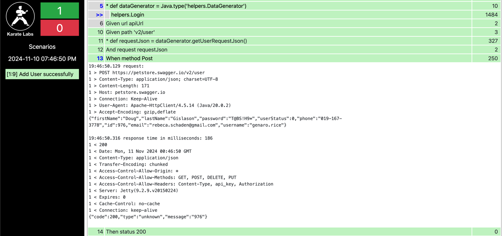

API Automation Karate DSL BDD
===============

This test automation project for automating in-sprint/functional/regression tests for the **PetStore** API Application using BDD (Behavioural Driven Development). 
The tests are built using **Gherkin**, **JAVA**, **Karate DSL**, **JUnit** and **Maven**.

**Karate DSL** is a popular open-source framework for API testing that is built on top of **Cucumber**. It allows you to write tests in a simple, readable domain-specific language (DSL) with minimal setup. Karate integrates both API testing and UI testing in one framework, offering powerful features like performance testing, mocking, and data-driven testing.

Project Structure
------------
```
ApiAutomation-KarateDSL
        | pom.xml
        ├── src
        │    └── test
        │        └── java
        │            ├── helpers
        │            │   ├── DataGenerator.java
        │            │   └── Login.feature
        │            ├── petstore
        │            │   ├── PetstoreTest.java
        │            │   └── features
        │            │       ├── AddUser.feature
        │            │       └── Inventory.feature
        │            ├── logback-test.xml
        │            └── karate-config.js
        └── README.md
```


Installation
------------
**Prerequisites**

- **JDK 11+** to run Java-based tests
- **Maven** for dependency management and running tests
- **IDE** Intellij or other

**Clone the Repository**

```commandline
git clone https://github.com/insprintautomation/TestAutomationProjects.git
cd Automation-SampleProjects/ApiAutomation-KarateDSL
```

**Install Dependencies**

Make sure `Maven` is installed on your machine. Then, run the following command to install all the dependencies:
`mvn clean install -DskipTests`

Karate Configuration
-----
Create a `karate-config.js` file and configure the environment, API baseurl and base steps.
```javascript
function fn() {
  var env = karate.env; // get system property 'karate.env'
  karate.log('karate.env system property was:', env);
  if (!env) {
    env = 'dev';
  }
  var config = {
    apiUrl: 'https://petstore.swagger.io/'
  }
  let sessionId = karate.callSingle('classpath:helpers/Login.feature', config).sessionId
//  karate.configure('headers', {Authorization: 'Token ' + accessToken})
  return config;
}
```

Create a `JUnit` Test runner class `PetstoreTest.java`.
```java
package petstore;

import com.intuit.karate.Results;
import com.intuit.karate.Runner;
import org.junit.jupiter.api.Test;
import static org.junit.jupiter.api.Assertions.assertEquals;

public class PetstoreTest {
    @Test
    void testParallel() {
        Results results = Runner.path("classpath:petstore")
                .outputCucumberJson(true)
                .parallel(5);
        assertEquals(0, results.getFailCount(), results.getErrorMessages());
    }
}
```

BDD Tests
-------

Below is the test scripts for testing inventory and user feature/endpoints in Petstore API. Refer Karate documentation for the step's usage.

**Inventory.feature:** Performs a GET request on endpoint `v2/store/inventory` and validates the response.
```gherkin
@smoke @regression @inventory
Feature: Get Inventory

  Background: Define URL
    Given url apiUrl

  @in-sprint @story-test123
  Scenario: Get Inventory details
    Given path 'v2/store/inventory'
    When method Get
    Then status 200
    And assert response.sold >= 1
    And assert response.pending >= 0
    And assert response.available >= 0
```

**User.feature:** Performs a POST request on endpoint `v2/user` and validates the response. Uses a custom DataGenerators JAVA class to get test data using Faker and generates request body.
```gherkin
@smoke @regression @addUser
Feature: Add User

  Background: Define URL
    * def dataGenerator = Java.type('helpers.DataGenerator')
    Given url apiUrl

  @story-test123 @in-sprint
  Scenario: Add User successfully
    Given path 'v2/user'
    * def requestJson = dataGenerator.getUserRequestJson()
    And request requestJson
    When method Post
    Then status 200
    And match response.code == 200
    And match response == {"code":200,"type":"#string","message":'#string'}
```

Data Generator
-----
`DataGenerator.java` uses Faker library to get random test data required to construct the request JSON for User account creation.
```java
package helpers;

import com.github.javafaker.Faker;
import net.minidev.json.JSONObject;
import java.security.SecureRandom;

public class DataGenerator {
  private static final String CHARACTERS = "ABCDEFGHIJKLMNOPQRSTUVWXYZabcdefghijklmnopqrstuvwxyz0123456789!@#$%^&*()-_=+";
  private static final int PASSWORD_LENGTH = 8;

  public static JSONObject getUserRequestJson() {
    Faker faker = new Faker();
    JSONObject json = new JSONObject();
    json.put("id", faker.number().randomNumber());
    json.put("username", faker.name().username());
    json.put("firstName", faker.name().firstName());
    json.put("lastName", faker.name().lastName());
    json.put("email", faker.internet().emailAddress());
    json.put("password", getRandomPassword());
    json.put("phone", faker.phoneNumber().cellPhone());
    json.put("userStatus", 0);
    return json;
  }

  private static String getRandomPassword() {
    SecureRandom random = new SecureRandom();
    StringBuilder password = new StringBuilder(PASSWORD_LENGTH);
    for (int i = 0; i < PASSWORD_LENGTH; i++) {
      int index = random.nextInt(CHARACTERS.length());
      password.append(CHARACTERS.charAt(index));
    }
    return password.toString();
  }
}
```

Running Tests
-----
Add build step in pom.xml to run tests using `maven-surefire-plugin`.
```xml
<build>
        <testResources>
            <testResource>
                <directory>src/test/java</directory>
                <excludes>
                    <exclude>**/*.java</exclude>
                </excludes>
            </testResource>
        </testResources>
        <plugins>
            <plugin>
                <groupId>org.apache.maven.plugins</groupId>
                <artifactId>maven-surefire-plugin</artifactId>
                <version>${maven.surefire.version}</version>
                <configuration>
                    <argLine>-Dfile.encoding=UTF-8</argLine>
                </configuration>
            </plugin>
        </plugins>
</build>
```
**CommandLine:** 

Change to directory `ApiAutomation-KarateDSL`.

To execute all tests, run maven command ``mvn clean test``.

To filter specific group of tests and execute, run maven command ``mvn test -Dkarate.options="--tags @inventory"``.

**Run/Debug configurations in IntelliJ:**

Create run/debug configurations in IntelliJ using menu navigation `Run -> Edit Configurations -> Add New Configurations`

Using `Maven` configuration, Select `Maven` from the run/debug configurations window. Name the configuration, enter command `clean test` in Run input box and Apply. 



Using `JUnit` configuration, Select `JUnit` from the run/debug configurations window. Name the configuration, select `ApiAutomation-KarateDSL` module and `PetstoreTest.java` class and Apply.



To Run/Debug configuration, select the saved configuration and click Play or Debug button.

Reports
-------------
After the test execution, Karate reports will be generated in `target\karate-reports` directory.
Open `karate-summary.html` in browser.



To see the tests and steps details for a feature, click on the feature file link.



To see the logs, click on the steps having links.



References
-------------

- Karate Labs WebSite: https://www.karatelabs.io
- Karate Labs Github: https://github.com/karatelabs/karate
- Petstore API Swagger: https://petstore.swagger.io