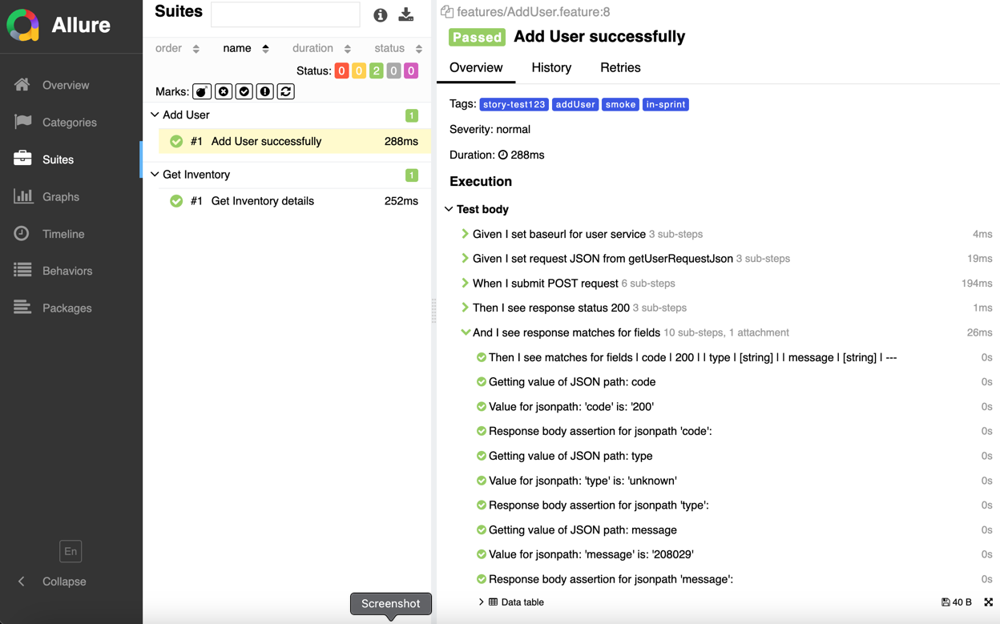
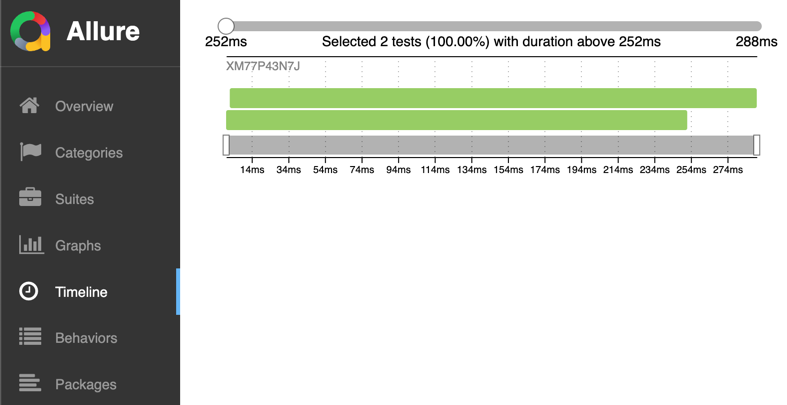
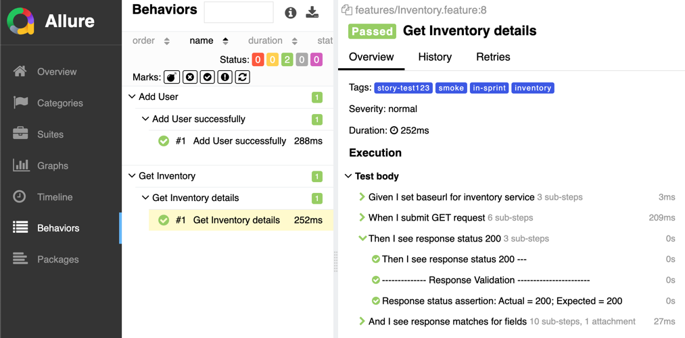
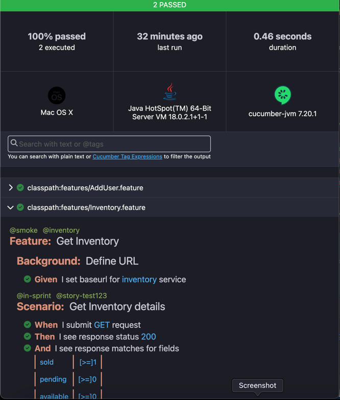
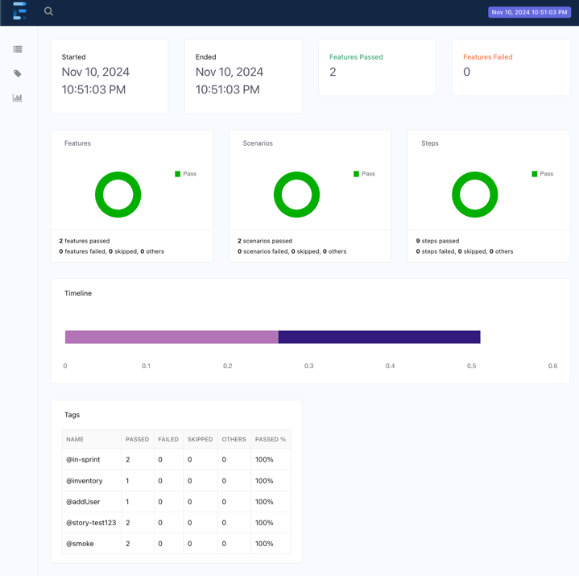
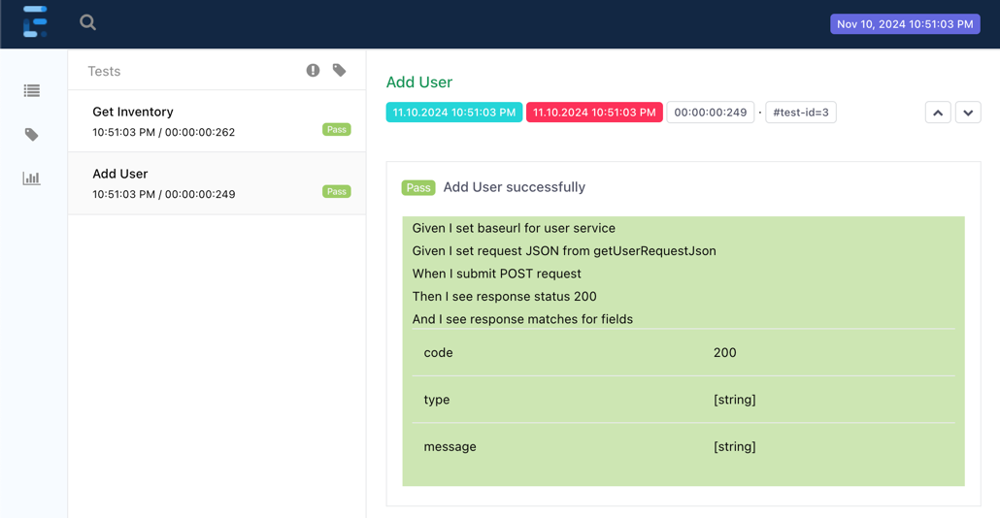

API Automation RestAssured & BDD
===============

This is a sample test automation project for automating in-sprint/functional/regression tests for the Sample **PetStore** API Application. The tests are built using **JAVA**, **RestAssured**, **Cucumber BDD**, **TestNG** and **Maven**.

Project Structure
------------
```
ApiAutomation-RestAssured-BDD
        | pom.xml
        ├── src
        │   ├── main
        │   │   ├── java
        │   │   │   ├── api.automation.bdd.steps
        │   │   │   │   └── APICommonSteps.java
        │   │   │   └── api.automation.utils
        │   │   │       ├── ApiUtil.java
        │   │   │       ├── DataGenerator.java
        │   │   │       ├── LogUtil.java
        │   │   │       └── PropertiesUtil.java
        │   │   └── resources
        │   │       └── extent.properties
        │   └── test
        │       ├── java
        │       │   └── petstore.api.automation
        │       │       ├── bdd
        │       │       │   ├── BaseSetup.java
        │       │       │   └── TestNGRunner.java
        │       │       └── restassured.testng
        │       │           ├── BaseSetup.java
        │       │           └── InventoryTest.java
        │       └── resources
        │            ├── features
        │            │   ├── AddUser.feature
        │            │   └── Inventory.feature
        │            └── config.properties
        ├── reports
        │   ├── allure-results
        │   ├── cucumber
        │   ├── extent
        │   └── logs
        └── README.md
```

Installation
------------
**Prerequisites**

- **JDK 11+** to run Java-based tests
- **Maven** for dependency management and running tests
- **Allure** for starting allure reports
- **IDE** Intellij or other

**Clone the Repository**

```commandline
git clone https://github.com/insprintautomation/Automation-SampleProjects.git
cd Automation-SampleProjects/ApiAutomation-RestAssured-BDD
```

**Install Dependencies**

Make sure `Maven` is installed on your machine. Then, run the following command to install all the dependencies:
`mvn clean install -DskipTests`

Configuration
-----
Create a `src\main\resources\extent.properties` file to configure the extent report.
```properties
basefolder.name= reports/extent/ExtentReport
basefolder.datetimepattern = MMM-d_HH-mm-ss
extent.reporter.spark.start=true
extent.reporter.spark.out=index.html
```

Create a `src\test\resources\config.properties` file to configure the environment, API baseurl and report flags.
```properties
environment=prod

# report and log config
consoleLogs=false
cucumberLogs=false
allureLogs=true
logFile=true
attachLogs=false

# api base url
prod.api.url=https://petstore.swagger.io/
test.api.url=

# api base path
inventory=v2/store/inventory
user=v2/user
```

BDD Tests
-------

Below is the test scripts for testing inventory and user endpoints in Petstore API using Cucumber BDD approach.

**Feature File:**

**Inventory.feature:** Performs a GET request on endpoint `v2/store/inventory` and validates response.
```gherkin
@smoke @inventory
Feature: Get Inventory

  Background: Define URL
    Given I set baseurl for inventory service

  @in-sprint @story-test123
  Scenario: Get Inventory details
    When I submit GET request
    Then I see response status 200
    And I see response matches for fields
      | sold      | [>=]1 |
      | pending   | [>=]0 |
      | available | [>=]0 |
```

**User.feature:** Performs a POST request on endpoint `v2/user` and validates response. Uses a custom DataGenerators JAVA class to get test data using Faker and generates request body.
```gherkin
@smoke @addUser
Feature: Add User

  Background: Define URL
    Given I set baseurl for user service

  @in-sprint @story-test123
  Scenario: Add User successfully
    Given I set request JSON from getUserRequestJson
    When I submit POST request
    Then I see response status 200
    And I see response matches for fields
      | code    | 200      |
      | type    | [string] |
      | message | [string] |
```

**Test Runner:**

Test Runner class can be created using TestNG or JUnit. Below is the example code for running tests using TestNG.
```java
package com.petstore.api.automation.bdd;

import io.cucumber.testng.AbstractTestNGCucumberTests;
import io.cucumber.testng.CucumberOptions;
import org.testng.annotations.DataProvider;

@CucumberOptions(
        features = "classpath:features",
        glue = {"com.api.automation.bdd.steps", "com.petstore.api.automation.bdd"},
        tags = "@smoke",
        monochrome = true,
        dryRun = false,
        plugin = {"html:reports/cucumber/cucumber.html",
                "json:reports/cucumber/cucumber.json",
                "com.aventstack.extentreports.cucumber.adapter.ExtentCucumberAdapter:",
                "io.qameta.allure.cucumber7jvm.AllureCucumber7Jvm",
                "rerun:reports/cucumber/failed_scenarios.txt",
                "pretty"},
        publish = true
)
public class TestNGRunner extends AbstractTestNGCucumberTests {

    @DataProvider(parallel = true)
    public Object[][] scenarios() {
        return super.scenarios();
    }
}
```

**BaseSetup:**

`BaseSetup.java` has the common code for setup and tear down. Method uses cucumber or testng/junit annotations.
Below example code uses `@BeforeAll` annotation from cucumber to load the properties file.
```java
package com.petstore.api.automation.bdd;

import com.api.automation.utils.PropertiesUtil;
import io.cucumber.java.BeforeAll;

public class BaseSetup {

    @BeforeAll
    public static void beforeAll() {
        PropertiesUtil.loadProperties("config.properties");
    }
}
```

**Step Definitions:**
`APICommonSteps.java` has step definitions for most common steps required for api automation. This common steps reduces coding required and enables faster script development to support in-sprint automation.
```java
package com.api.automation.bdd.steps;

import com.api.automation.utils.LogUtil;
import com.api.automation.utils.ApiUtil;
import com.api.automation.utils.DataGenerator;
import io.cucumber.datatable.DataTable;
import io.cucumber.java.Scenario;
import io.cucumber.java.en.And;
import io.cucumber.java.en.Given;
import io.cucumber.java.en.Then;
import io.cucumber.java.en.When;
import lombok.extern.slf4j.Slf4j;

import java.lang.reflect.InvocationTargetException;
import java.lang.reflect.Method;
import java.util.HashMap;
import java.util.Map;
import java.util.Objects;

@Slf4j
public class APICommonSteps {

    private ApiUtil apiUtil;

    @Given("I set baseurl for {} service")
    public void setBaseurl(String apiName) {
        apiUtil = new ApiUtil();
        LogUtil.logStep("Given I set baseurl for %s service".formatted(apiName));
        apiUtil.setBaseUrl(apiName); }

    @And("I set {} parameters")
    public void setParameters(String parameterType, DataTable params) {
        LogUtil.logStep("Given I set %s parameters".formatted(parameterType));
        Map<String, String> inputParams = Objects.isNull(params)
                ? new HashMap<>()
                : new HashMap<>(params.asMap());
        apiUtil.setParams(parameterType, new HashMap<>(inputParams));
    }

    @And("I set headers")
    public void setHeaders(DataTable headers) {
        LogUtil.logStep("Given I set headers %s".formatted(headers));
        apiUtil.setHeaders(new HashMap<>(headers.asMap()));
    }

    @When("I submit {} request")
    public void submitRequest(String method) {
        LogUtil.logStep("When I submit %s request".formatted(method));
        apiUtil.submitRequest(method);
    }

    @Then("I see response status {}")
    public void verifyResponseStatus(Integer statusCode) {
        LogUtil.logStep("Then I see response status %s".formatted(statusCode));
        apiUtil.verifyResponseStatus(statusCode);
    }

    @Then("I see response matches for fields")
    public void verifyResponseBody(DataTable data) {
        LogUtil.logStep("Then I see matches for fields %s".formatted(data));
        apiUtil.verifyResponseBody(data.asMap());
    }

    @Then("I see response header value matches for headers")
    public void verifyResponseHeaders(DataTable data) {
        LogUtil.logStep("Then I see response header value matches for headers %s".formatted(data));
        apiUtil.verifyResponseHeaders(new HashMap<>(data.asMap()));
    }

    @Then("I check all {} items")
    public void verifyResponseBodyAllItems(String jsonPath, DataTable data) {
        LogUtil.logStep("Then I check all %s items %s".formatted(jsonPath, data));
        apiUtil.verifyResponseAllItems(jsonPath, new HashMap<>(data.asMap()));
    }

    @Then("I save {} as {} from response")
    public void saveResponse(String jsonPath, String name) {
        LogUtil.logStep("Then I save %s as %s from response".formatted(jsonPath, name));
        apiUtil.saveResponse(jsonPath, name, false);
    }

    @Then("I get random {} from response & save as {}")
    public void saveResponseRandom(String jsonPath, String name) {
        LogUtil.logStep("Then I get random %s from response & save as %s".formatted(jsonPath, name));
        apiUtil.saveResponse(jsonPath, name, true);
    }

    @Then("I see response matches json schema {}")
    public void verifyJsonSchema(String fileName) {
        LogUtil.logStep("Then I see response matches json schema %s".formatted(fileName));
        apiUtil.verifyJsonSchema(fileName);
    }

    @And("I set request JSON string")
    public void setRequestBodyAsString(String requestBody) {
        LogUtil.logStep("Given I set request JSON string %n %s".formatted(requestBody));
        apiUtil.setRequestJson(requestBody);
    }

    @Given("I set request JSON from {}")
    public void setRequestBody(String requestJsonMethod) {
        LogUtil.logStep("Given I set request JSON from %s".formatted(requestJsonMethod));
        try {
            Method dataMethod = DataGenerator.class.getMethod(requestJsonMethod);
            Object requestJson = dataMethod.invoke(new DataGenerator());
            setRequestBodyAsString(String.valueOf(requestJson));
        } catch (NoSuchMethodException | IllegalAccessException | InvocationTargetException e) {
            throw new RuntimeException(e);
        }
    }

    @And("I set {} as {}")
    public void setValue(String name, String value) {
        LogUtil.logStep("Given I set %s as %s".formatted(name, value));
        apiUtil.saveValue(name, value);
    }
}
```
TestNG Tests
-----
**Approach1:** Using RestAssured methods
Below is the sample scripts for testing add user endpoint `v2/user` for petstore API using RestAssured and TestNG.
```java
package com.petstore.api.automation.restassured.testng;

import com.api.automation.utils.DataGenerator;
import com.api.automation.utils.PropertiesUtil;
import io.restassured.RestAssured;
import org.testng.annotations.Test;
import static org.hamcrest.CoreMatchers.equalTo;
import static org.hamcrest.CoreMatchers.not;
import static org.hamcrest.Matchers.empty;

public class UserTest extends BaseSetup {
    //  Using RestAssured directly
    @Test
    public void userTest() {
        String requestBody = DataGenerator.getUserRequestJson();
        String baseUri = PropertiesUtil.getProperty("prod.api.url");
        RestAssured.given()
                .log().all()
                .baseUri(baseUri)
                .header("Content-Type", "application/json")
                .body(requestBody)
                .when()
                .post("v2/user")
                .then()
                .log().all()
                .statusCode(200)
                .body("code", equalTo(200))
                .body("type", not(empty()))
                .body("message", not(empty()));
    }
}
```

**Approach 2:** Using Custom ApiUtil methods
Below is the sample scripts for testing add inventory endpoint `v2/store/inventory` for petstore API using `ApiUtil.java` wrapper methods which uses RestAssured.
```java
package com.petstore.api.automation.restassured.testng;

import com.api.automation.utils.ApiUtil;
import org.testng.annotations.Test;
import static io.restassured.http.Method.GET;

public class InventoryTest extends BaseSetup {
    //  Using ApiUtil wrapper methods which uses RestAssured
    @Test
    public void inventoryTest() {
        ApiUtil apiUtil = new ApiUtil();
        apiUtil.setBaseUrl("inventory");
        apiUtil.submitRequest(GET.name());
        apiUtil.verifyResponseStatus(200);
        apiUtil.verifyResponseBody("sold", "[>=]1");
        apiUtil.verifyResponseBody("pending", "[>=]0");
    }
}
```

Utils
-------
**ApiUtil:** [ApiUtil.java] has common reusable wrapper methods using RestAssured to create API request and perform response validations.

**DataGenerator:**
`DataGenerator.java` uses Faker library to get random test data required to construct the request JSON for User account creation.
```java
package helpers;

import com.github.javafaker.Faker;
import net.minidev.json.JSONObject;
import java.security.SecureRandom;

public class DataGenerator {
  private static final String CHARACTERS = "ABCDEFGHIJKLMNOPQRSTUVWXYZabcdefghijklmnopqrstuvwxyz0123456789!@#$%^&*()-_=+";
  private static final int PASSWORD_LENGTH = 8;

    public static String getUserRequestJson() {
        Faker faker = new Faker();
        JSONObject json = new JSONObject();
        json.put("id", faker.number().randomNumber());
        json.put("username", faker.name().username());
        json.put("firstName", faker.name().firstName());
        json.put("lastName", faker.name().lastName());
        json.put("email", faker.internet().emailAddress());
        json.put("password", getRandomPassword());
        json.put("phone", faker.phoneNumber().cellPhone());
        json.put("userStatus", 0);
        return json.toString();
    }

  private static String getRandomPassword() {
    SecureRandom random = new SecureRandom();
    StringBuilder password = new StringBuilder(PASSWORD_LENGTH);
    for (int i = 0; i < PASSWORD_LENGTH; i++) {
      int index = random.nextInt(CHARACTERS.length());
      password.append(CHARACTERS.charAt(index));
    }
    return password.toString();
  }
}
```

Running Tests
-----
Add build step in pom.xml to run tests using `maven-surefire-plugin`.
```xml
<build>
    <plugins>
        <plugin>
            <groupId>org.apache.maven.plugins</groupId>
            <artifactId>maven-surefire-plugin</artifactId>
            <version>3.1.2</version>
            <configuration>
                <testFailureIgnore>false</testFailureIgnore>
                <systemPropertyVariables>
                    <allure.results.directory>
                        ${project.basedir}/reports/allure-results
                    </allure.results.directory>
                </systemPropertyVariables>
                <argLine>
                    -javaagent:"${settings.localRepository}/org/aspectj/aspectjweaver/${aspectj.version}/aspectjweaver-${aspectj.version}.jar"
                </argLine>
            </configuration>
            <dependencies>
                <dependency>
                    <groupId>org.aspectj</groupId>
                    <artifactId>aspectjweaver</artifactId>
                    <version>${aspectj.version}</version>
                </dependency>
            </dependencies>
        </plugin>
    </plugins>
</build>
```
**CommandLine:** 

Change to directory `ApiAutomation-RestAssured-BDD`.

To execute all tests, run maven command ``mvn clean test``.

To filter specific group of tests and execute, run maven command ``mvn test -Dkarate.options="--tags @inventory"``.

**Run/Debug configurations in IntelliJ:**

Create run/debug configurations in IntelliJ using menu navigation `Run -> Edit Configurations -> Add New Configurations`

Using `Maven` configuration, Select `Maven` from the run/debug configurations window. Name the configuration, enter command `clean test` in Run input box and Apply. 


Using `JUnit` configuration, Select `JUnit` from the run/debug configurations window. Name the configuration, select `ApiAutomation-KarateDSL` module and `PetstoreTest.java` class and Apply.


To Run/Debug configuration, select the saved configuration and click Play or Debug button.

Reports
-------------
After the test execution, allure, cucumber and extent reports will be generated in `reports` directory.

**Allure Report:**
Start the allure report using command line `allure serve` from the `reports` directory.









**Cucumber Report:**
Open `reports/cucumber/cucumber.html` in browser.


**Extent Report:**
Open `reports/extent/index.html` in browser.





References
-------------

- Karate Labs WebSite: https://www.karatelabs.io
- Karate Labs Github: https://github.com/karatelabs/karate
- Petstore API Swagger: https://petstore.swagger.io