Web Automation Cucumber BDD
===============

This test automation project is for automating in-sprint/functional/regression tests for the **saucedemo** Web Application using **Behavioural Driven Development(BDD)** framework. 
The tests are built using **Gherkin**, **JAVA**, **Selenium WebDriver 4**, **Cucumber BDD**, **TestNG** and **Maven**.
Framework uses **Page Object Model(POM)** using Page Factory.

Project Structure
------------
```
WebAutomation-BDD
        | pom.xml
        ├── src
        │   ├── main
        │   │   ├── java
        │   │   │   ├── com.web.automation.pageobjects
        │   │   │   │   ├── CartPage.java
        │   │   │   │   ├── CheckoutPage.java
        │   │   │   │   ├── InventoryPage.java
        │   │   │   │   └── LoginPage.java
        │   │   │   └── com.web.automation.utils
        │   │   │       ├── CommonUtil.java
        │   │   │       ├── Constants.java
        │   │   │       ├── CSVDataUtil.java
        │   │   │       └── DriverManager.java
        │   │   └── resources
        │   │       └── extent.properties
        │   └── test
        │       ├── java
        │       │   └── com.saucedemo.bdd.automation.test
        │       │       ├── DataConstants.java
        │       │       ├── PageObjects.java
        │       │       ├── runner
        │       │       │   ├── TestNGRunner.java
        │       │       │   └── TestNGRunnerReRunFailed.java
        │       │       └── stepdefinitions
        │       │           ├── BaseSetup.java
        │       │           ├── CartSteps.java
        │       │           ├── CheckoutSteps.java
        │       │           ├── InventorySteps.java
        │       │           └── LoginSteps.java
        │       └── resources
        │            ├── data
        │            │   └── accounts.csv
        │            ├── features
        │            │   ├── login.feature
        │            │   └── productOrder.feature
        │            └── config.properties
        ├── reports
        │   ├── allure-results
        │   ├── cucumber
        │   ├── extent
        │   └── screenshots
        └── README.md
```

Installation
------------
**Prerequisites**

- **JDK 11+** to run Java-based tests
- **Maven** for dependency management and running tests
- **Allure** for starting allure reports
- **IDE** Intellij or other

**Clone the Repository**

```commandline
git clone https://github.com/insprintautomation/TestAutomationProjects.git
cd TestAutomationProjects/WebAutomation-BDD
```

**Install Dependencies**

Make sure `Maven` is installed on your machine. Then, run the following command to install all the dependencies:
`mvn clean install -DskipTests`

Configuration
-----
Create a `src/main/resources/extent.properties` file to configure the extent report.
```properties
basefolder.name= reports/extent/ExtentReport
basefolder.datetimepattern = MMM-d_HH-mm-ss
extent.reporter.spark.start=true
extent.reporter.spark.out=index.html
screenshot.dir=reports/screenshots
screenshot.rel.path=../screenshots/
```

Create a `src/test/resources/config.properties` file to configure the browser, device lab, environment, timeouts and other configs.
```properties
# All values can be over witten by command ex: -Dbrowser=safari
# execution environment and device config
browser = chrome
headless = false
testLab = local
labUrl=

# test environment config
environment = test
test.url = https://www.saucedemo.com/

# test accounts config
accountsCSV = src/test/resources/data/accounts.csv

# timeout config
implicit.wait = 10
explicit.wait = 30
pageload.wait = 20
script.wait = 5

screenshot.file = reports/screenshot/screenshot-%s.png
```

Framework Utils
-------
**DriverManager:** 
[DriverManager.java](./src/main/java/com/web/automation/utils/DriverManager.java) has reusable methods to create driver instance for all types of browsers, create capabilities/driver options, stop driver, load url and take screenshots.

**CSVDataUtil:**
[CSVDataUtil.java](./src/main/java/com/web/automation/utils/CSVDataUtil.java) has methods to load CSV accounts file and get account data based on account type provided.

**CommonUtil:**
[CommonUtil.java](./src/main/java/com/web/automation/utils/CommonUtil.java) has methods to load properties file and get value from command line arguments or properties file, and other utility methods.

**Constants:**
[Constants.java](./src/main/java/com/web/automation/utils/Constants.java) has BrowserType enum and other constants.

Page Objects
-------
Page Object Model (POM) is a design pattern used to create object-oriented classes that serve as an interface to the web page. A Page Object class is a model that represents a page in your application and encapsulates all the interactions with the page elements (e.g., buttons, forms, fields) on that page.
The PageFactory class is part of the Selenium WebDriver library and helps in implementing the Page Object Model (POM) design pattern, making your code more maintainable and readable.
For the `Saucedemo` web application, below page object classes are created using Page Factory and contains web elements and methods to interact with those elements.

**Login Page:**
```java
public class LoginPage {
    // page factory
    @FindBy(id = "user-name")
    private WebElement userNameBox;

    @FindBy(css = "#password")
    private WebElement passwordBox;

    @FindBy(name = "login-button")
    private WebElement loginBtn;

    @FindBy(css = "[data-test='error'")
    private WebElement error;

    // login using username and email provided
    public void login(String userName, String password) {
        userNameBox.sendKeys(userName);
        passwordBox.sendKeys(password);
        loginBtn.click();
    }

    // validates error message displayed in login page for invalid login
    public void checkError(String expectedError) {
        String actualError = error.getText();
        assertTrue(actualError.contains(expectedError),
                "Check error displayed in login: '%s' has '%s'".formatted(actualError, expectedError));
    }
}
```

**Inventory Page:**
```java
public class InventoryPage {
    @FindBy(css = ".title")
    private WebElement title;

    @FindBy(css = "a.shopping_cart_link")
    private WebElement cartLink;

    // dynamic locator - creates locator at runtime based on product name provided
    private WebElement addToCartBtn(String productName) {
        return getDriver().findElement(By.name("add-to-cart-%s".formatted(productName)));
    }

    public void checkTitle(String expectedTitle) {
        assertEquals(title.getText(), expectedTitle);
    }

    // Adds list of products to cart and navigates to cart page
    public void addProductsToCart(String[] products) {
        for (String product : products) {
            addToCartBtn(product.trim()).click();
        }
        cartLink.click();
    }
}
```

**Cart Page:**
```java
public class CartPage {
    @FindBy(id = "checkout")
    private WebElement checkoutBtn;

    public void continueToCheckout() {
        checkoutBtn.click();
    }
}
```

**Checkout Page:**
```java
public class CheckoutPage {
    @FindBy(id = "first-name")
    private WebElement firstName;

    @FindBy(css = "input[data-test='lastName']")
    private WebElement lastName;

    @FindBy(xpath = "//input[@data-test='postalCode']")
    private WebElement zipCode;

    @FindBy(className = "submit-button")
    private WebElement continueBtn;

    @FindBy(name = "finish")
    private WebElement finishBtn;

    @FindBy(className = "title")
    private WebElement title;

    @FindBy(css = "[data-test='pony-express']")
    private WebElement completeImg;

    @FindBy(className = "complete-header")
    private WebElement completeHeader;

    @FindBy(className = "complete-text")
    private WebElement completeDesc;

    // enters customer info and navigates to review page
    public void enterCustomerInfo(Map<String, String> data) {
        firstName.sendKeys(data.get("firstName"));
        lastName.sendKeys(data.get("lastName"));
        zipCode.sendKeys(data.get("zipCode"));
        continueBtn.click();
    }

    public void submitOrder() {
        finishBtn.click();
    }

    // validates the order confirmation page
    public void checkOrderConfirmation() {
        assertEquals(title.getText(), "Checkout: Complete!");
        assertEquals(completeImg.getAttribute("alt"), "Pony Express");
        assertEquals(completeHeader.getText(), "Thank you for your order!");
        assertEquals(completeDesc.getText(), "Your order has been dispatched, and will arrive just as fast as the pony can get there!");
    }
}
```

**PageObject Initialization:**
PageFactory.initElements(driver, this) initializes the elements annotated with @FindBy based on the provided driver instance. It binds the elements to the corresponding web elements on the page.
```java
public class PageObjects {
    public PageObjects() {
        initializePageObjects();
    }

    public LoginPage loginPage;
    protected InventoryPage inventoryPage;
    protected CartPage cartPage;
    protected CheckoutPage checkoutPage;

    public void initializePageObjects() {
        loginPage = PageFactory.initElements(DriverManager.getDriver(), LoginPage.class);;
        inventoryPage = PageFactory.initElements(DriverManager.getDriver(), InventoryPage.class);
        cartPage = PageFactory.initElements(DriverManager.getDriver(), CartPage.class);
        checkoutPage = PageFactory.initElements(DriverManager.getDriver(), CheckoutPage.class);
    }
}
```

BDD Tests
-------

Below is the test scripts for testing `login` and `product order` features in `Saucedemo` web application using `Cucumber BDD` approach.

**Feature File:**

**login.feature:** Validates the login functionality of Saucedemo web application. Positive and negative scenarios with data driven testing is implemented.
```gherkin
@login @regression @smoke
Feature: Login
  As a customer, I should be able to successfully login with valid credentials, and see error for invalid credentials.

  Background:
    Given I am in login page

  @smoke @positive
  Scenario Outline: Login Successfully as <accountType> user
    When I login as a <accountType> user
    Then I should see inventory page
    @good
    Examples:
      | accountType |
      | standard    |
      | visual      |
    @bad
    Examples:
      | accountType |
      | problem     |
      | performance |
      | error       |

  @negative
  Scenario Outline: Login as <accountType> user and check the error message
    When I login as a <accountType> user
    Then I should see '<error>' message

    Examples:
      | accountType   | error                                       |
      | locked        | Sorry, this user has been locked out        |
      | empty         | Username is required                        |
      | passwordEmpty | Password is required                        |
      | invalid       | Username and password do not match any user |
```

**productOrder.feature:** Validates product ordering flow for Saucedemo web application. Data driven testing is implemented to place order for different products data.
```gherkin
@order @regression @smoke
Feature: Product Order
  As a customer, I should be able to browse products, add products to cart and place order successfully.

  Background:
    Given I am in login page

  @smoke @positive
  Scenario Outline: Successfully place order for product(s) - <products>
    Given I login as a <accountType> user
    When I add '<products>' products to cart
    And I proceed to checkout
    And I enter customer information
    And I review & submit the order
    Then I should see order confirmation
    @good
    Examples:
      | accountType | products                                       |
      | standard    | sauce-labs-backpack                            |
      | visual      | sauce-labs-bike-light, sauce-labs-bolt-t-shirt |
```

**Step Definitions:**

`LoginSteps.java` has step definitions for the Login page operations.
```java
package com.saucedemo.bdd.automation.test.stepdefinitions;

public class LoginSteps extends PageObjects {
    @Given("I am in login page")
    public void loginPage() {
        DriverManager.loadUrl();
    }

    @When("I login as a {} user")
    public void loginAsAUser(String userType) {
        Map<String, String> account = getAccount(userType);
        loginPage.login(account.get("userName"), account.get("password"));
    }

    @Then("I should see {string} message")
    public void iShouldSeeMessage(String expectedError) {
        loginPage.checkError(expectedError);
    }
}
```

`InventorySteps.java` has step definitions for the Inventory page operations.
```java
public class InventorySteps extends PageObjects {
    @Then("I should see inventory page")
    public void checkInventoryPage() {
        inventoryPage.checkTitle(DataConstants.PRODUCTS);
    }

    @When("I add {string} products to cart")
    public void iAddProductsToCart(String product) {
        String[] products = product.split(",");
        inventoryPage.addProductsToCart(products);
    }
}
```

`CartSteps.java` has step definitions for the Cart page operations.
```java
public class CartSteps extends PageObjects {
    @And("I proceed to checkout")
    public void proceedToCheckout() {
        cartPage.continueToCheckout();
    }
}
```

`CheckoutSteps.java` has step definitions for the Checkout page operations.
```java
public class CheckoutSteps extends PageObjects {
    @And("I enter customer information")
    public void enterCustomerInfo() {
        checkoutPage.enterCustomerInfo(DataConstants.custInfoData);
    }

    @And("I review & submit the order")
    public void iReviewSubmitTheOrder() {
        checkoutPage.submitOrder();
    }

    @Then("I should see order confirmation")
    public void iShouldSeeOrderConfirmation() {
        checkoutPage.checkOrderConfirmation();
        DriverManager.getScreenshot();
    }
}
```

**BaseSetup:**

`BaseSetup.java` has the common code for setup and tear down. Methods can use cucumber or testng/junit annotations.
Below code uses annotation from cucumber, 
`@BeforeAll` to load the properties and csv accounts file. 
`@Before` to initialize the driver instance for each test.
`@After` to stop the driver instance for each test.

```java
public class BaseSetup extends PageObjects {

    private final DriverManager driverManager;

    public BaseSetup(DriverManager driverManager) {
        this.driverManager = driverManager;
    }

    @BeforeAll
    public static void suiteSetup() {
        loadProperties("src/test/resources/config.properties");
        String accountsCSV = getProperty("accountsCSV");
        loadAccounts(accountsCSV);
    }

    @Before
    public void beforeScenario(Scenario scenario) {
        driverManager.initializeDriver();
    }

    @After
    public void afterScenario(Scenario scenario) {
        driverManager.stopDriver();
    }

    @AfterAll
    public static void suiteTearDown() {}
}
```

**Test Runner:**

Test Runner class can be created using TestNG or JUnit. Below is the example code for running tests using TestNG.
```java
package com.saucedemo.bdd.automation.test.runner;

@CucumberOptions(
        features = "classpath:features",
        glue = "com.saucedemo.bdd.automation.test.stepdefinitions",
        tags = "@smoke",
        monochrome = true,
        dryRun = false,
        plugin = {"html:reports/cucumber/cucumber.html",
                "json:reports/cucumber/cucumber.json",
                "com.aventstack.extentreports.cucumber.adapter.ExtentCucumberAdapter:",
                "io.qameta.allure.cucumber7jvm.AllureCucumber7Jvm",
                "rerun:reports/cucumber/failed_scenarios.txt",
                "pretty"},
        publish = true
)
public class TestNGRunner extends AbstractTestNGCucumberTests {
    @DataProvider(parallel = true)
    public Object[][] scenarios() {
        return super.scenarios();
    }
}
```

Test Runner to run failed scenarios from previous execution.
```java
package com.saucedemo.bdd.automation.test.runner;

import io.cucumber.testng.AbstractTestNGCucumberTests;
import io.cucumber.testng.CucumberOptions;
import org.testng.annotations.DataProvider;

@CucumberOptions(
        features = "@reports/cucumber/failed_scenarios.txt",
        glue = "com.saucedemo.bdd.automation.test.stepdefinitions",
        monochrome = true,
        plugin = {"html:reports/cucumber/cucumber.html",
        "json:reports/cucumber/cucumber.json",
        "com.aventstack.extentreports.cucumber.adapter.ExtentCucumberAdapter:",
        "pretty"}
)
public class TestNGRunnerReRunFailed extends AbstractTestNGCucumberTests {
    @DataProvider(parallel = false)
    public Object[][] scenarios() {
        return super.scenarios();
    }
}
```

CSV Test Data
-----
CSV data file is used to store test accounts. Other columns can be added based on the requirement. 
`CSVDataUtil.java` has methods to read and get values from CSV file.
```csv
accountType,userName,password,environment
standard,standard_user,secret_sauce,all
visual,visual_user,secret_sauce,test
locked,locked_out_user,secret_sauce,test
```

Running BDD Tests
-----
Add build step in pom.xml to run tests using `maven-surefire-plugin`.
```xml
<build>
    <plugins>
        <plugin>
            <groupId>org.apache.maven.plugins</groupId>
            <artifactId>maven-surefire-plugin</artifactId>
            <version>3.1.2</version>
            <configuration>
                <testFailureIgnore>false</testFailureIgnore>
                <systemPropertyVariables>
                    <allure.results.directory>
                        ${project.basedir}/reports/allure-results
                    </allure.results.directory>
                </systemPropertyVariables>
                <argLine>
                    -javaagent:"${settings.localRepository}/org/aspectj/aspectjweaver/${aspectj.version}/aspectjweaver-${aspectj.version}.jar"
                </argLine>
            </configuration>
            <dependencies>
                <dependency>
                    <groupId>org.aspectj</groupId>
                    <artifactId>aspectjweaver</artifactId>
                    <version>${aspectj.version}</version>
                </dependency>
            </dependencies>
        </plugin>
    </plugins>
</build>
```
**CommandLine:** 

Change to directory `WebAutomation-BDD`.

To execute all tests, run maven command ``mvn clean test``.

To filter specific group of `Cucumber BDD` tests and execute, run maven command ``mvn clean test -Dcucumber.filter.tags="@order" -Denvironment=test``.

To run `Cucumber BDD` tests using parallel threads, run maven command ``mvn clean test -Ddataproviderthreadcount=5``.

**Run/Debug configurations in IntelliJ:**

Create run/debug configurations in IntelliJ using menu navigation `Run -> Edit Configurations -> Add New Configurations`

Using `Maven` configuration, Select `Maven` from the run/debug configurations window. Name the configuration, enter command `clean test -Dcucumber.filter.tags="@order" -Denvironment=test` in Run input box, select `WebAutomation-BDD` module and Apply. 

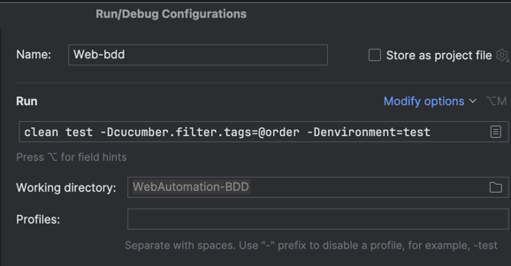

Using `TestNG` configuration, Select `TestNG` from the run/debug configurations window. Name the configuration, select `WebAutomation-BDD` module and `TestNGRunner.java` class and Apply.

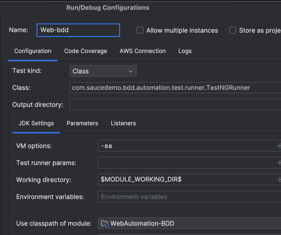

To Run/Debug configuration, select the saved configuration and click Play or Debug button.

**Run Console Output:**

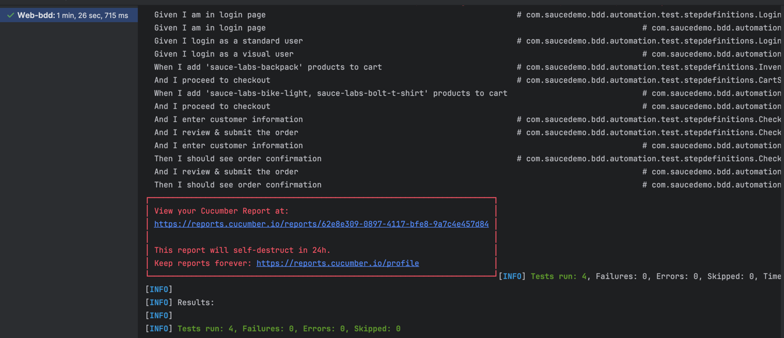

Reports
-------------
After the test execution, allure, cucumber and extent reports will be generated in `reports` directory.

**Allure Report:**

Start the allure report using command line `allure serve` from the `reports` directory.

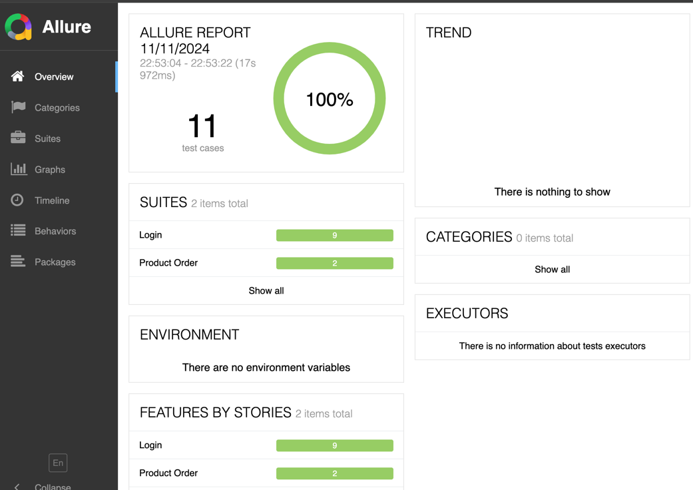

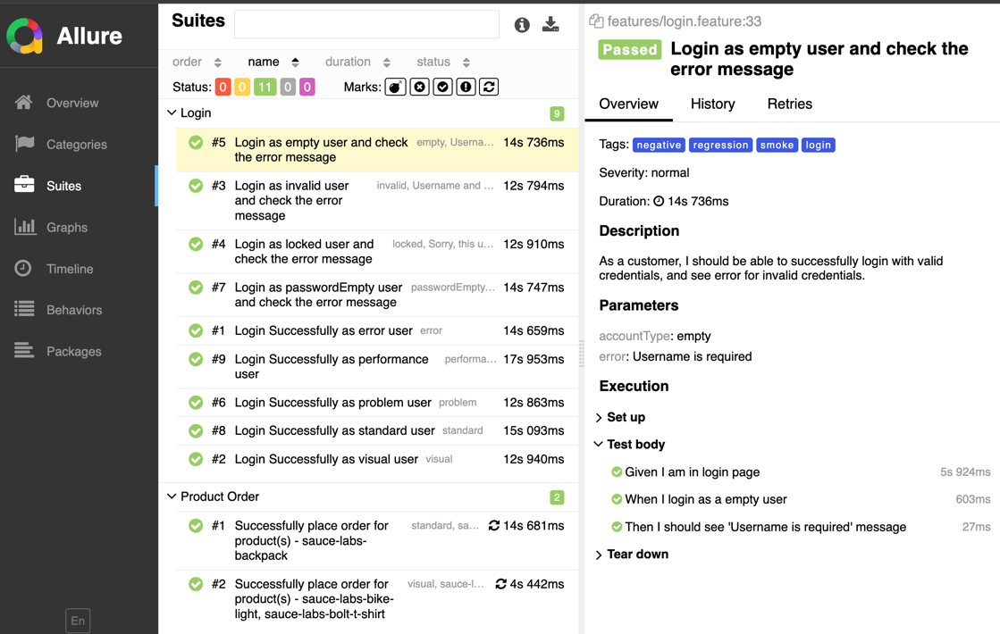

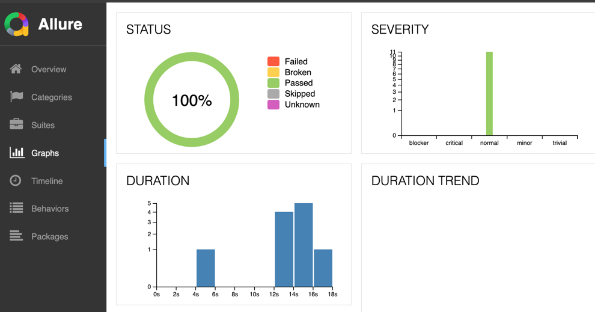

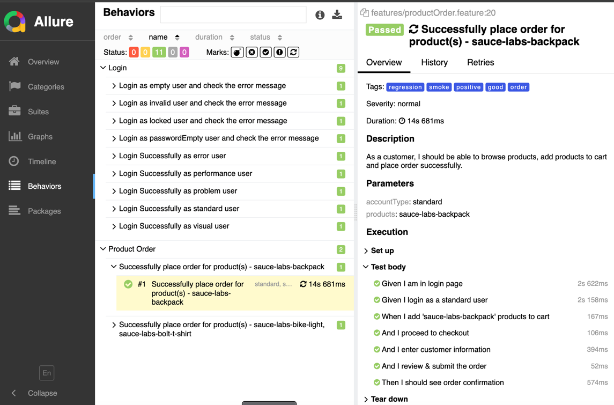

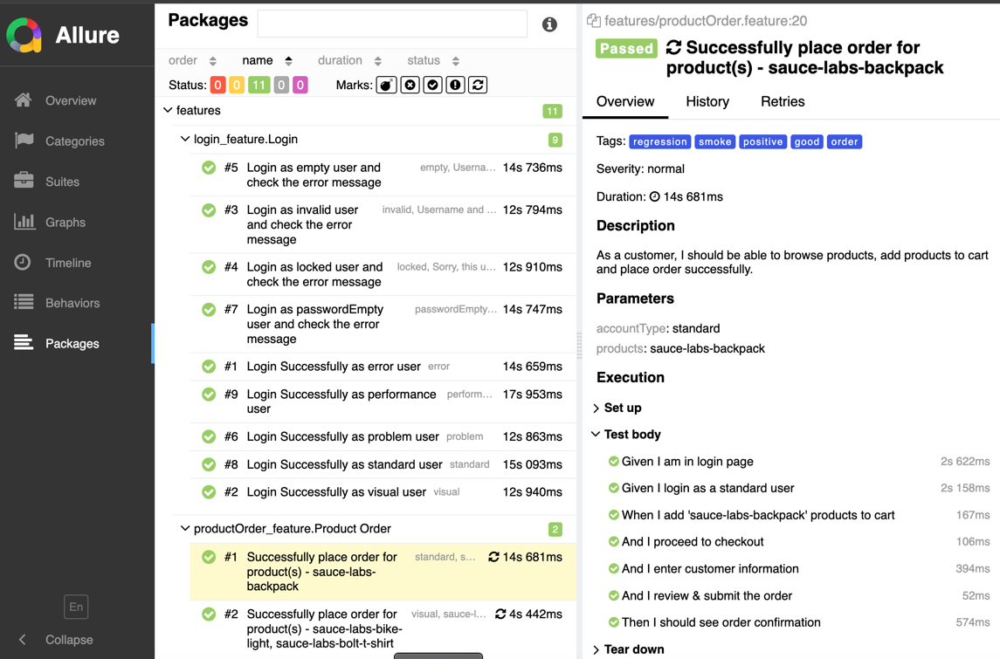

**Cucumber Report:**

Open `reports/cucumber/cucumber.html` in browser.

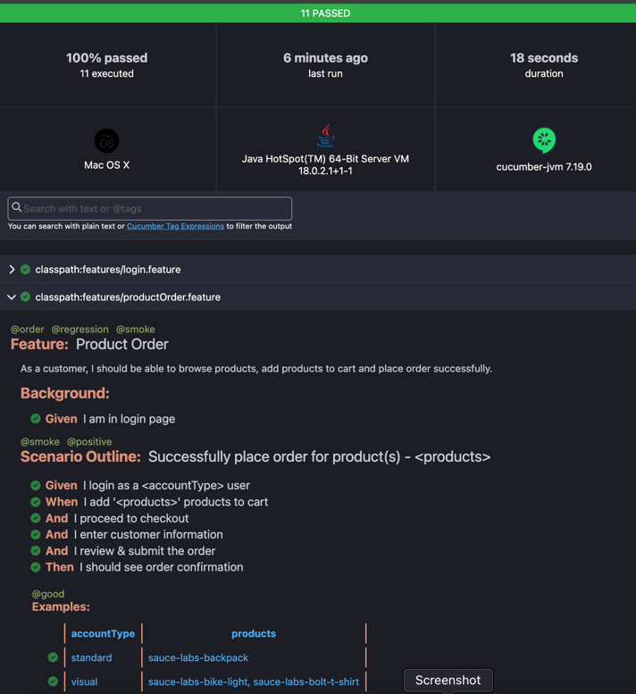

**Extent Report:**

Open `reports/extent/index.html` in browser.

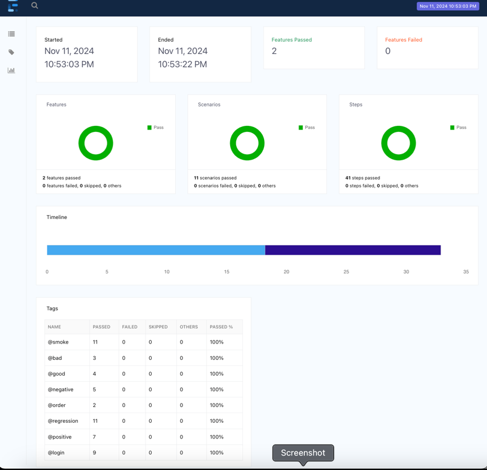

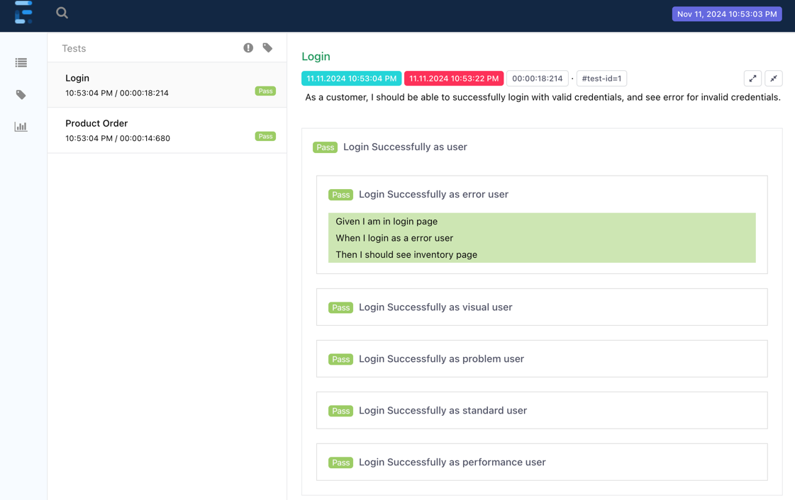

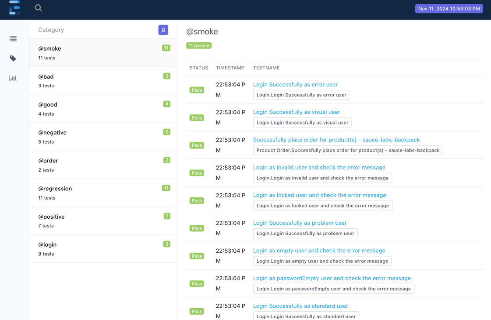

**Screenshot:**

See screenshot images in reports/screenshots

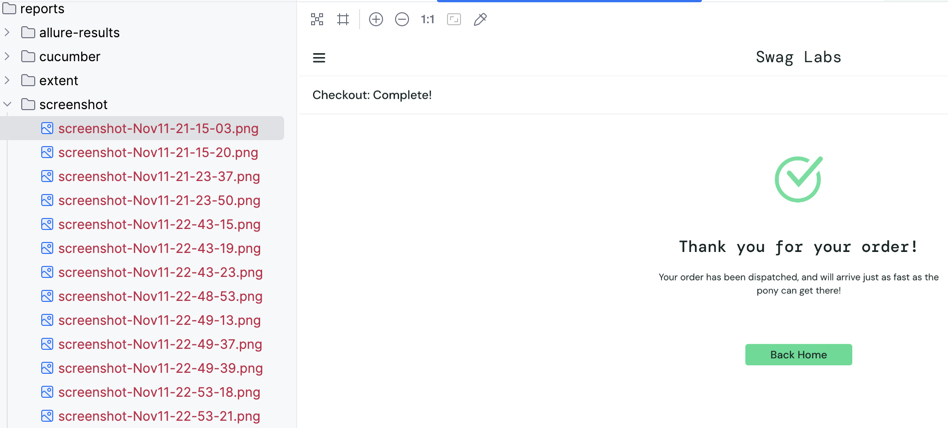

References
-------------

- Selenium WebDriver: https://www.selenium.dev/documentation/webdriver
- Selenium Grid: https://www.selenium.dev/documentation/grid
- Cucumber: https://cucumber.io/docs/cucumber
- Saucedemo Web Application: https://www.saucedemo.com