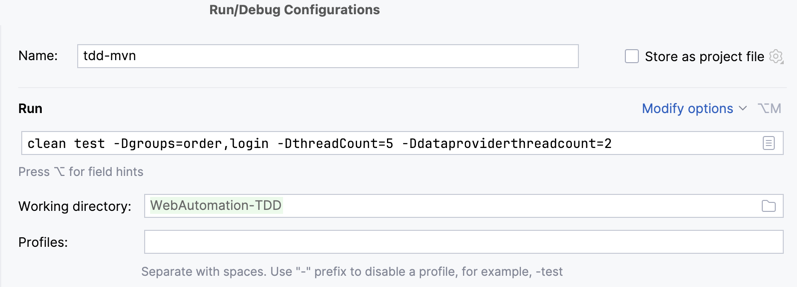
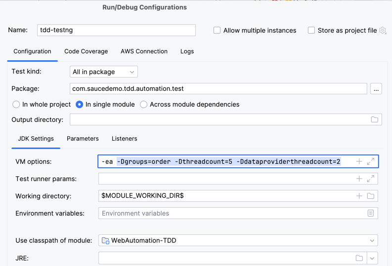
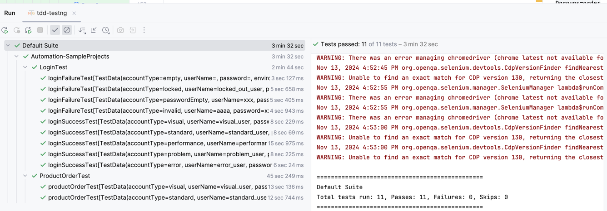
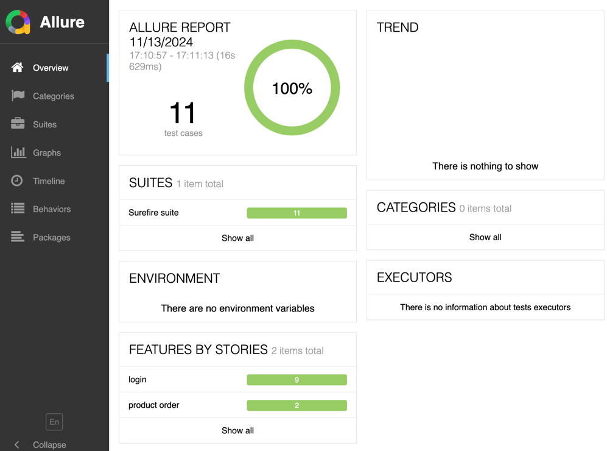
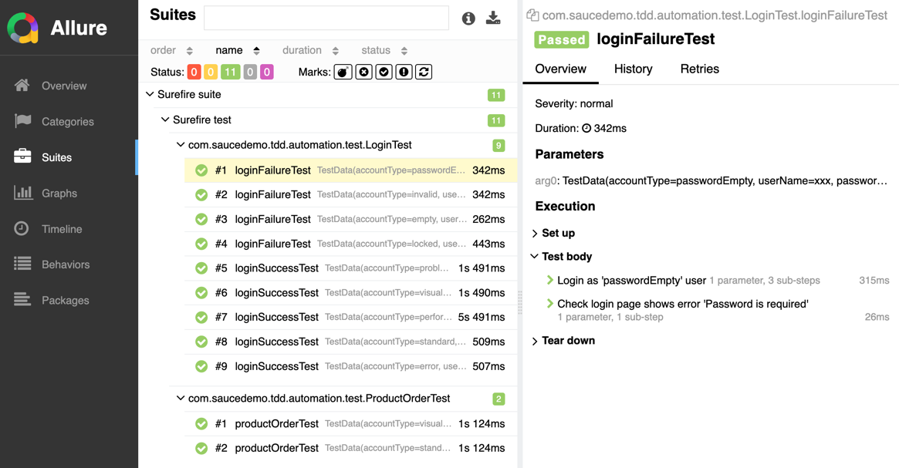
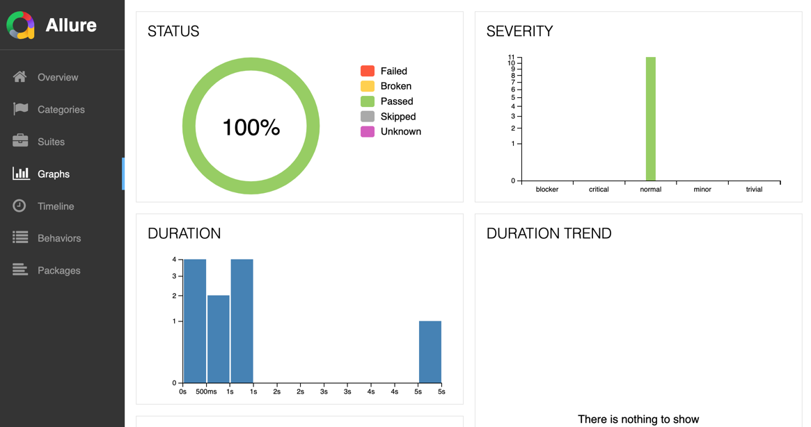
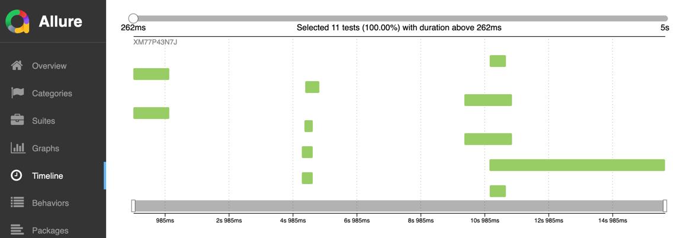
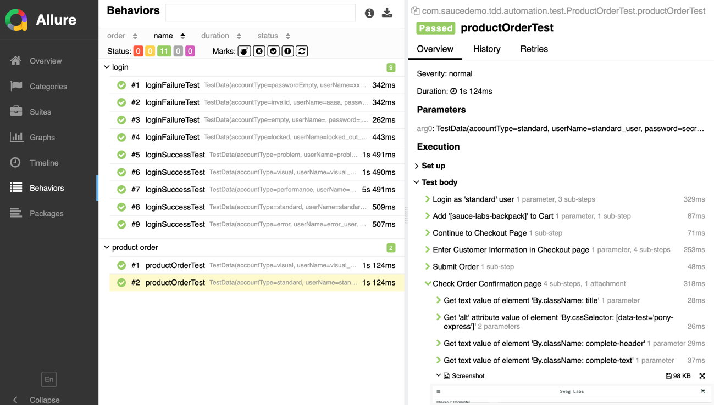
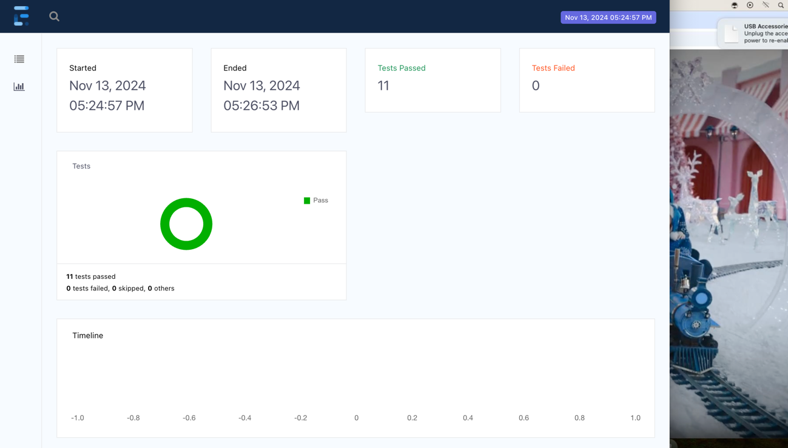
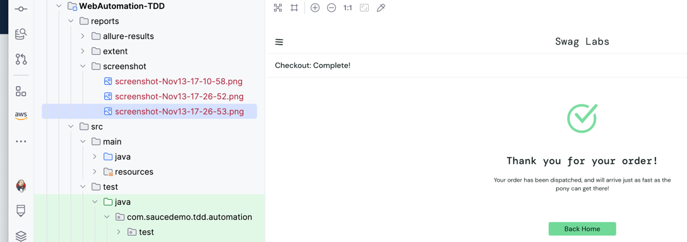

Web Automation TestNG TDD
===============

This test automation project is for automating in-sprint/functional/regression tests for the **saucedemo** Web Application using **Test Driven Development(TDD)** framework. 
The tests are built using **JAVA**, **Selenium WebDriver 4**, **TestNG** and **Maven**.
Framework uses **Page Object Model(POM)**.

Project Structure
------------
```
WebAutomation-TDD
        | pom.xml
        ├── src
        │   ├── main
        │   │   └── java
        │   │       ├── com.web.automation.pageobjects
        │   │       │   ├── CartPage.java
        │   │       │   ├── CheckoutPage.java
        │   │       │   ├── InventoryPage.java
        │   │       │   └── LoginPage.java
        │   │       └── com.web.automation.utils
        │   │           ├── dataprovider
        │   │           │   ├── JsonDataProvider.java
        │   │           │   └── model
        │   │           │       ├── CustomerInfo.java
        │   │           │       └── TestData.json
        │   │           ├── CommonUtil.java
        │   │           ├── Constants.java
        │   │           ├── CSVDataUtil.java
        │   │           ├── DriverManager.java
        │   │           └── WebUtil.java
        │   └── test
        │       ├── java
        │       │   └── com.saucedemo.tdd.automation
        │       │       ├── DataConstants.java
        │       │       ├── PageObjects.java
        │       │       └── test
        │       │           ├── BaseSetup.java
        │       │           ├── LoginTest.java
        │       │           └── ProductOrder.java
        │       └── resources
        │            ├── data
        │            │   ├── accounts.csv
        │            │   ├── loginTest.json
        │            │   └── productOrderTest.json
        │            └── config.properties
        ├── reports
        │   ├── allure-results
        │   ├── extent
        │   └── screenshots
        └── README.md
```

Installation
------------
**Prerequisites**

- **JDK 11+** to run Java-based tests
- **Maven** for dependency management and running tests
- **Allure** for starting allure reports
- **IDE** Intellij or other

**Clone the Repository**

```commandline
git clone https://github.com/insprintautomation/TestAutomationProjects.git
cd TestAutomationProjects/WebAutomation-TDD
```

**Install Dependencies**

Make sure `Maven` is installed on your machine. Then, run the following command to install all the dependencies:
`mvn clean install -DskipTests`

Configuration
-----

Create a `src/test/resources/config.properties` file to configure the browser, device lab, environment, timeouts and other configs.
```properties
# All values can be over witten by command ex: -Dbrowser=safari
# execution environment and device config
browser = chrome
headless = false
testLab = local
labUrl=

# test environment config
environment = test
test.url = https://www.saucedemo.com/

# test accounts config
accountsCSV = src/test/resources/data/accounts.csv

# timeout config
implicit.wait = 10
explicit.wait = 30
pageload.wait = 20
script.wait = 5

screenshot.file = reports/screenshot/screenshot-%s.png
```

Framework Utils
-------
**DriverManager:** 
[DriverManager.java](./src/main/java/com/web/automation/utils/DriverManager.java) has reusable methods to create driver instance for all types of browsers, create capabilities/driver options, stop driver, load url and take screenshots.

**CSVDataUtil:**
[CSVDataUtil.java](./src/main/java/com/web/automation/utils/CSVDataUtil.java) has methods to load CSV accounts file and get account data based on account type provided.

**CommonUtil:**
[CommonUtil.java](./src/main/java/com/web/automation/utils/CommonUtil.java) has methods to load properties file and get value from command line arguments or properties file, and other utility methods.

**Constants:**
[Constants.java](./src/main/java/com/web/automation/utils/Constants.java) has BrowserType enum and other constants.

**WebUtil:** has reusable wrapper methods on top of Selenium to perform operations on Web Application.
```java
public class WebUtil extends DriverManager {

    public WebElement getElement(By locator) {
        return getDriver().findElement(locator);
    }

    @Step("Type value '{value}' in element '{element}'")
    public void typeValue(By element, String value) {
        getElement(element).sendKeys(value);
    }

    @Step("Click on element '{element}'")
    public void click(By element) {
        getElement(element).click();
    }

    @Step("Get text value of element '{element}'")
    public String getText(By element) {
        return getElement(element).getText();
    }

    @Step("Get '{attribute}' attribute value of element '{element}'")
    public String getValue(By element, String attribute) {
        return getElement(element).getAttribute(attribute);
    }
}
```

**Data Provider:**
In TestNG, a DataProvider is a powerful feature that allows you to run a test method multiple times with different sets of data. It is useful when you want to run the same test with different inputs to validate various conditions.

Below `JsonDataProvider.java` has the code to handle JSON data for TestNG tests using DataProvider.
```java
public class JsonDataProvider {

    /**
     * Data Provider gets data from JSON based on Test executed. Test will be executed for no of data sets available.
     *
     * @param testContext (ITestNGMethod) testng ITestNGMethod has various methods to get current test method executed
     * @return data list iterator
     */
    @DataProvider(name = Constants.JSON_DATA_PROVIDER, parallel = true)
    public Iterator<Object[]> jsonDataProvider(ITestNGMethod testContext) throws IOException {
        String testName = testContext.getMethodName();
        String jsonFileName = testContext.getRealClass().getSimpleName();
        File jsonFile = new File(String.format(Constants.JSON_DATA_FILE, jsonFileName));
        List<TestData> jsonDataList = getJsonDataArray(jsonFile, testName);
        if (jsonDataList.isEmpty()) {
            jsonDataList = getJsonDataArray(jsonFile, testName);
        }
        Collection<Object[]> dataList = new ArrayList<>();
        for (TestData jsonData : jsonDataList) {
            dataList.add(new Object[]{jsonData});
        }
        return dataList.iterator();
    }

    /**
     * Reads JSON file content and returns the value for key as a List of TestData object's. Used for JSON Array data.
     * Test data can be excluded using 'excludeTest' parameter.
     *
     * @param jsonFile JSON file
     * @param key      to get a specific JSONObject from JSON file
     * @throws IOException when file not found or unable to get data
     */
    private List<TestData> getJsonDataArray(File jsonFile, String key) throws IOException {
        Map<String, Object> jsonData = CommonUtil.readJsonFile(jsonFile);
        List<Map<String, Object>> dataList = (List<Map<String, Object>>) jsonData.get(key);
        if (Objects.isNull(dataList)) {
            log.info(String.format("Data not exists for key '%s' in file %s.", key, jsonFile));
            return Collections.emptyList();
        }
        List<TestData> testDataList = new ArrayList<>();
        ObjectMapper objectMapper = new ObjectMapper().configure(SerializationFeature.FAIL_ON_EMPTY_BEANS, false);
        dataList.forEach(data -> {
            // integrates accounts.csv
            if (data.containsKey(Constants.ACCOUNT_TYPE)) {
                Map<String, String> accountData = CSVDataUtil.getAccount(data.get(Constants.ACCOUNT_TYPE).toString());
                if (!accountData.isEmpty()) {
                    data.putAll(accountData);
                }
            }
            testDataList.add(objectMapper.convertValue(data, TestData.class));
        });
        return testDataList;
    }
}
```

**TestData Model:**
Below is the TestData model class to parse JSON data and use it in Test scripts. Additional model classes and fields can be based on the requirement.
```java
package com.web.automation.utils.dataprovider.model;

import lombok.Getter;
import lombok.Setter;
import lombok.ToString;

@Getter @Setter @ToString
public class TestData {
    private String accountType;
    private String userName;
    private String password;
    private String environment;
    private String error;
    private List<String> products;
    private CustomerInfo customerInfo;
}
```

Page Objects
-------
Page Object Model (POM) is a design pattern used to create object-oriented classes that serve as an interface to the web page. A Page Object class is a model that represents a page in your application and encapsulates all the interactions with the page elements (e.g., buttons, forms, fields) on that page.
For the `Saucedemo` web application, below page object classes are created using Page Object Model and contains web elements and methods to interact with those elements.

**Login Page:**
```java
public class LoginPage extends WebUtil {

    private final By userNameBox = By.id("user-name");

    private final By passwordBox = By.cssSelector("#password");

    private final By loginBtn = By.name("login-button");

    private final By error = By.cssSelector("[data-test='error'");

    // login using username and email provided
    @Step("Login as '{data.accountType}' user")
    public void login(TestData data) {
        typeValue(userNameBox, data.getUserName());
        typeValue(passwordBox, data.getPassword());
        click(loginBtn);
    }

    // validates error message displayed in login page for invalid login
    @Step("Check login page shows error '{expectedError}'")
    public void checkError(String expectedError) {
        String actualError = getText(error);
        assertTrue(actualError.contains(expectedError),
                "Check error displayed in login: '%s' has '%s'".formatted(actualError, expectedError));
    }
}
```

**Inventory Page:**
```java
public class InventoryPage extends WebUtil {

    private By title = By.cssSelector(".title");

    private By cartLink = By.cssSelector("a.shopping_cart_link");

    // dynamic locator - creates locator at runtime based on product name provided
    private WebElement addToCartBtn(String productName) {
        return getDriver().findElement(By.name("add-to-cart-%s".formatted(productName)));
    }

    @Step("Check value inventory page title is '{expectedTitle}'")
    public void checkTitle(String expectedTitle) {
        assertEquals(getText(title), expectedTitle);
    }

    @Step("Add '{products}' to Cart")
    public void addProductsToCart(List<String> products) {
        for (String product : products) {
            addToCartBtn(product.trim()).click();
        }
        click(cartLink);
    }
}
```

**Cart Page:**
```java
public class CartPage extends WebUtil {

    private final By checkoutBtn = By.id("checkout");

    @Step("Continue to Checkout Page")
    public void continueToCheckout() {
        click(checkoutBtn);
    }
}
```

**Checkout Page:**
```java
public class CheckoutPage extends WebUtil {

    private final By firstName = By.id("first-name");

    private final By lastName = By.cssSelector("input[data-test='lastName']");

    private final By zipCode = By.xpath("//input[@data-test='postalCode']");

    private final By continueBtn = By.className("submit-button");

    private final By finishBtn = By.name("finish");

    private final By title = By.className("title");

    private final By completeImg = By.cssSelector("[data-test='pony-express']");

    private final By completeHeader = By.className("complete-header");

    private final By completeDesc = By.className("complete-text");

    @Step("Enter Customer Information in Checkout page")
    public void enterCustomerInfo(CustomerInfo data) {
        typeValue(firstName, data.getFirstName());
        typeValue(lastName, data.getLastName());
        typeValue(zipCode, data.getZipCode());
        click(continueBtn);
    }

    @Step("Submit Order")
    public void submitOrder() {
        click(finishBtn);
    }

    @Step("Check Order Confirmation page")
    public void checkOrderConfirmation() {
        assertEquals(getText(title), "Checkout: Complete!");
        assertEquals(getValue(completeImg, "alt"), "Pony Express");
        assertEquals(getText(completeHeader), "Thank you for your order!");
        assertEquals(getText(completeDesc), "Your order has been dispatched, and will arrive just as fast as the pony can get there!");
        getScreenshot();
    }
}
```

**PageObject Initialization:**
`PageObjects.java` has the page object class initialization.
```java
public class PageObjects {
    protected LoginPage loginPage = new LoginPage();
    protected InventoryPage inventoryPage = new InventoryPage();
    protected CartPage cartPage = new CartPage();
    protected CheckoutPage checkoutPage = new CheckoutPage();

}
```

Test Data
-----

**CSV Data:**
CSV data file in `src\test\resources\data.accounts.csv` is used to store test accounts. Other columns can be added based on the requirement.
`CSVDataUtil.java` has methods to read and get values from CSV file. It can integrated with JsonDataProvider using JSON data file.
```csv
accountType,userName,password,environment
standard,standard_user,secret_sauce,all
visual,visual_user,secret_sauce,test
locked,locked_out_user,secret_sauce,test
```

**JSON Data:**
JSON data file in `src\test\resources\` is used to store test data required for TestNG tests. JSON data file is organized based on the Test Class and Method names.
`JsonDataProvider.Json` class read the JSON data file based on the Test executed.
Below is the `LoginTest.json` JSON data file for Tests in `LoginTest.java` class. 
For example, TestNG executes `loginSuccessTest` method for the number of accountType's provided in the JSON file.
```json
{
  "loginSuccessTest": [
    {
      "accountType": "standard"
    },
    {
      "accountType": "visual"
    },
    {
      "accountType": "problem"
    },
    {
      "accountType": "performance"
    },
    {
      "accountType": "error"
    }
  ],
  
  "loginFailureTest": [
    {
      "accountType": "locked",
      "error": "Sorry, this user has been locked out"
    },
    {
      "accountType": "empty",
      "error": "Username is required"
    },
    {
      "accountType": "passwordEmpty",
      "error": "Password is required"
    },
    {
      "accountType": "invalid",
      "error": "Username and password do not match any user"
    }
  ]
}
```

`ProctOrder.json`
```json
{
  "productOrderTest": [
    {
      "accountType": "standard",
      "products": ["sauce-labs-backpack"],
      "customerInfo": {
        "firstName": "test",
        "lastName": "test",
        "zipCode": "19000"
      }
    },
    {
      "accountType": "visual",
      "products": ["sauce-labs-bike-light", "sauce-labs-bolt-t-shirt"],
      "customerInfo": {
        "firstName": "test1",
        "lastName": "test1",
        "zipCode": "18000"
      }
    }
  ]
}
```

TestNG Tests
-------

Below is the test scripts for testing `login` and `product order` features in `Saucedemo` web application using `TestNG TDD` approach.

**Login Test:** Validates the login functionality of Saucedemo web application. Positive and negative scenarios with data driven testing is implemented.
```java
package com.saucedemo.tdd.automation.test;

import com.saucedemo.tdd.automation.DataConstants;
import com.web.automation.utils.dataprovider.JsonDataProvider;
import com.web.automation.utils.dataprovider.model.TestData;
import io.qameta.allure.Feature;
import org.testng.annotations.Test;

public class LoginTest extends BaseSetup {

    @Test(groups = {DataConstants.SMOKE, DataConstants.REGRESSION, DataConstants.LOGIN},
            dataProvider = JSON_DATA_PROVIDER, dataProviderClass = JsonDataProvider.class)
    @Feature(DataConstants.LOGIN)
    public void loginSuccessTest(TestData data) {
        loginPage.login(data);
        inventoryPage.checkTitle(DataConstants.PRODUCTS);
    }

    @Test(groups = {DataConstants.SMOKE, DataConstants.REGRESSION, DataConstants.LOGIN},
            dataProvider = JSON_DATA_PROVIDER, dataProviderClass = JsonDataProvider.class)
    @Feature(DataConstants.LOGIN)
    public void loginFailureTest(TestData data) {
        loginPage.login(data);
        loginPage.checkError(data.getError());
    }
}
```

**ProductOrder Test:** Validates product ordering flow for Saucedemo web application. Data driven testing is implemented to place order for different product's data.
```java
package com.saucedemo.tdd.automation.test;

import com.web.automation.utils.dataprovider.JsonDataProvider;
import com.web.automation.utils.dataprovider.model.TestData;
import io.qameta.allure.Feature;
import org.testng.annotations.Test;

import static com.saucedemo.tdd.automation.DataConstants.*;
import static com.web.automation.utils.Constants.JSON_DATA_PROVIDER;

public class ProductOrderTest extends BaseSetup {

    @Test(groups = {SMOKE, REGRESSION, LOGIN},
            dataProvider = JSON_DATA_PROVIDER, dataProviderClass = JsonDataProvider.class)
    @Feature(PRODUCT_ORDER)
    public void productOrderTest(TestData data) {
        loginPage.login(data);
        inventoryPage.addProductsToCart(data.getProducts());
        cartPage.continueToCheckout();
        checkoutPage.enterCustomerInfo(data.getCustomerInfo());
        checkoutPage.submitOrder();
        checkoutPage.checkOrderConfirmation();
    }
}
```

**BaseSetup:**
`BaseSetup.java` has the common code for setup and tear down. Method uses testng annotations.
Below code uses annotation from TestNG, 
`@BeforeSuite` to load the properties, csv accounts file and initialize Extent report. 
`@BeforeMethod` to initialize the driver instance, load test url and create test in Extent report for each test.
`@AfterMethod` to stop the driver instance for each test.
`@AfterSuite` to stop the Extent report.

```java
package com.saucedemo.tdd.automation.test;

import com.aventstack.extentreports.ExtentReports;
import com.aventstack.extentreports.reporter.ExtentSparkReporter;
import com.saucedemo.tdd.automation.PageObjects;
import com.web.automation.utils.DriverManager;
import org.testng.ITestContext;
import org.testng.ITestResult;
import org.testng.annotations.AfterMethod;
import org.testng.annotations.AfterSuite;
import org.testng.annotations.BeforeMethod;
import org.testng.annotations.BeforeSuite;

import static com.web.automation.utils.CSVDataUtil.loadAccounts;
import static com.web.automation.utils.CommonUtil.getProperty;
import static com.web.automation.utils.CommonUtil.loadProperties;
import static com.web.automation.utils.DriverManager.loadUrl;

public class BaseSetup extends PageObjects {

    private final DriverManager driverManager;
    private static ExtentReports extentReport;

    public BaseSetup() {
        driverManager = new DriverManager();
    }

    @BeforeSuite
    public static void suiteSetup() {
        extentReport = new ExtentReports();
        ExtentSparkReporter extentSparkReport = new ExtentSparkReporter("reports/extent/extentReport.html");
        extentReport.attachReporter(extentSparkReport);
        loadProperties("src/test/resources/config.properties");
        String accountsCSV = getProperty("accountsCSV");
        loadAccounts(accountsCSV);
    }

    @BeforeMethod
    public void beforeMethod(ITestContext testContext) {
        extentReport.createTest(testContext.getName());
        driverManager.initializeDriver();
        loadUrl();
    }

    @AfterMethod
    public void afterMethod(ITestResult result) {
        driverManager.stopDriver();
    }

    @AfterSuite
    public static void suiteTearDown() {
        extentReport.flush();
    }
}
```

Running TestNG Tests
-----

Add build step in pom.xml to run tests using `maven-surefire-plugin`.
```xml
<build>
    <plugins>
        <plugin>
            <groupId>org.apache.maven.plugins</groupId>
            <artifactId>maven-surefire-plugin</artifactId>
            <version>3.1.2</version>
            <configuration>
                <systemPropertyVariables>
                    <allure.results.directory>${project.basedir}/reports/allure-results</allure.results.directory>
                </systemPropertyVariables>
                <argLine>
                    -javaagent:${settings.localRepository}/org/aspectj/aspectjweaver/${aspectj.version}/aspectjweaver-${aspectj.version}.jar
                </argLine>
                <includes>
                    <include>**/com.saucedemo.tdd.automation.test/*.java</include>
                </includes>
            </configuration>
            <dependencies>
                <dependency>
                    <groupId>org.aspectj</groupId>
                    <artifactId>aspectjweaver</artifactId>
                    <version>${aspectj.version}</version>
                </dependency>
            </dependencies>
        </plugin>
    </plugins>
</build>
```
**CommandLine:** 

Change to directory `WebAutomation-TDD`.

To execute all tests, run maven command ``mvn clean test``.

To filter specific group of `TestNG` tests and execute, run maven command ``mvn clean test -Dgroups=order -Denvironment=test``.

To run `TestNG` tests using parallel threads, run maven command ``mvn clean test -Dparallel=methods -Dthreadcount=5 -Ddataproviderthreadcount=2``.

**Run/Debug configurations in IntelliJ:**

Create run/debug configurations in IntelliJ using menu navigation `Run -> Edit Configurations -> Add New Configurations`

Using `Maven` configuration, Select `Maven` from the run/debug configurations window. Name the configuration, enter command `clean test -Dgroups=order,login -DthreadCount=5 -Ddataproviderthreadcount=2` in Run input box, select `WebAutomation-TDD` module and Apply. 



Using `TestNG` configuration, Select `TestNG` from the run/debug configurations window. Name the configuration, select `WebAutomation-TDD` module and `com.saucedemo.tdd.automation.test` package and Apply.



To Run/Debug configuration, select the saved configuration and click Play or Debug button.

**Run Console Output:**




Reports
-------------
After the test execution, allure, and extent reports will be generated in `reports` directory.

**Allure Report:**

Start the allure report using command line `allure serve` from the `reports` directory.



!







**Extent Report:**

Open `reports/extent/extentReport.html` in browser.



**Screenshot:**

See screenshot images in reports/screenshots



References
-------------

- Selenium WebDriver: https://www.selenium.dev/documentation/webdriver
- Selenium Grid: https://www.selenium.dev/documentation/grid
- TestNG: https://testng.org/
- Saucedemo Web Application: https://www.saucedemo.com